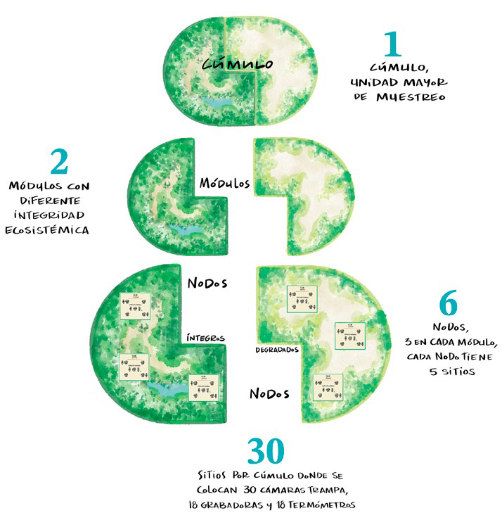
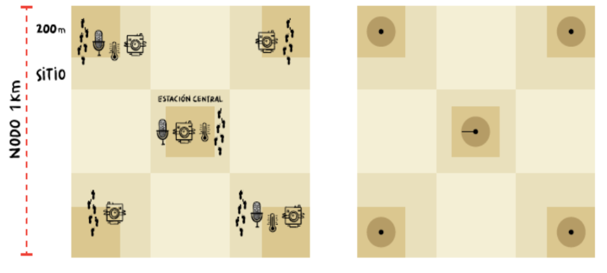

# Introducción

## Antecedentes

El Proyecto Conservación y uso Sostenible en Montañas y Sierras (CoSMoS) busca mejorar el estado de conservación y el uso sostenible de los ecosistemas de montaña de México ubicados en el Eje Neovolcánico Transversal, particularmente, en las Áreas Naturales Protegidas (ANP) y sus zonas de influencia. El proyecto está integrado por cuatro componentes que ejecutan CONANP, FMCN y CONABIO: A. *Manejo efectivo de ANP federales*, B. *Restauración*, C. *Emprendimientos* y como parte del componente D. *el Monitoreo de la biodiversidad*. Este último (componente D) tiene como uno de sus objetivos generales conocer mediante el monitoreo la condición y amenazas de los ecosistemas en la región del proyecto.

Para la ejecución exitosa del protocolo de monitoreo en el manual indica paso a paso la correcta colocación y configuración de las cámaras trampa, grabadoras y sensores de temperatura y humedad (dataloggers), así como la toma, captura y envío de información que se generan en campo mediante aplicaciones de celular.

Dentro de la región del proyecto CosMoS, se han propuestos diferentes sitios de muestreo con condiciones similares para llevar a cabo el monitoreo. El diseño espacial de muestreo toma la misma estructura general del diseño espacial de SiPeCaM, utilizando unidades de muestreo con características anidadas denominadas cúmulos, módulos, nodos y sitios.

# Cúmulos proyecto CoSMoS

## Cúmulos

Cada cúmulo se compone de dos elementos denominados módulos, los cuales tienen un valor de integridad ecosistémica diferente: módulo íntegridad alta (íntegro) y módulo con integridad media (degradado) (@fig-01).

{#fig-01 width="60%"}

En el siguiente mapa se muestran los Cúmulos propuestos para el proyecto CoSMoS.

<!--ACá poner el mapa interactivo de los cúmolos -->

```{r}

#| echo: false
#| warning: false
#| message: false
#| fig-cap: "Mapa de cúmulos"
#| fig-align: center

library(leaflet)
library(leaflet.extras)
library(rworldxtra)
library(sf)
library(tidyverse)

# cargar datos
Cumulos <- st_read("shape/Seleccionados_Cumulos.shp", quiet= TRUE)

# Transformar a WGS84 (EPSG:4326) - LATITUD/LONGITUD
Cumulos_Latlong <- st_transform(Cumulos, crs = 4326)

n_categorias <- length(unique(Cumulos_Latlong$layer2))
colores <- topo.colors(n_categorias)

leaflet() %>%
  addProviderTiles(providers$Esri.WorldImagery) %>%
  #addTiles() %>%  
  addPolygons(
    data = Cumulos_Latlong,
    color = ~colores[as.numeric(factor(layer2))],
    weight = 11,
    fillOpacity = 0.7,
    popup = ~as.character(layer2)
  ) %>%
  addLegend(
    position = "topright",
    colors = colores,
    labels = sort(unique(Cumulos_Latlong$layer2)),
    title = "Cúmulos CoSMoS",
    opacity = 0.8
  ) %>%
  addScaleBar(position = "bottomleft") %>%
  addMiniMap(toggleDisplay = TRUE)


```

## Modulos, nodos y sitios

Cada Cúmulo, se separa en dos grupos de acuerdo con su valor de integridad ecosistémica (IE): módulo íntegro y módulo degradado. Cada módulo se compone de tres elementos denominados nodos. En el mapa se aprecia un Cúmulo, el cual esta compuesto por dos módulos, y cada módulo se compone de tres elementos denominados nodos. Dentro de cada nodo se encuentran los *sitios* que son la unidad de muestreo más pequeña, y se refiere al lugar donde se van a colocar los sensores (cámaras trampa, grabadoras y sensor de temperatura). Así cada nodo es representado por 5 sitios en forma de un cuadrante de 1km2, en los cuales se ubicaran 5 cámaras trampa, 3 grabadoras y 3 sensores de temperatura y humedad, estos tendrán una disposición en diagonal sobre el cuadrante.

```{r}
#| echo: false
#| warning: false
#| message: false
#| fig-cap: "Mapa de cúmulos"
#| fig-align: center

library(leaflet)
library(leaflet.extras)
library(rworldxtra)
library(sf)
library(tidyverse)


# Cargar el shapefile
Cumulos <- st_read("shape/Seleccionados_Cumulos.shp", quiet = TRUE)

# Transformar a WGS84 (EPSG:4326) - LATITUD/LONGITUD
Cumulos_Latlong <- st_transform(Cumulos, crs = 4326)

# Cargar los puntos de los modulos
Cumulos_p <- st_read("shape/puntos_selec_C.shp", quiet = TRUE)

# Transformar a WGS84 (EPSG:4326) - LATITUD/LONGITUD
Cum_p_Latlong <- st_transform(Cumulos_p, crs = 4326)

# Paleta de colores
colores <- c("#9FFC31", "#F5FC31")

leaflet() %>%
  addProviderTiles(providers$Esri.WorldImagery) %>%
  # setView(lng = -98.6, lat = 19.5, zoom = 10) %>% 
  addPolygons(
    data = Cumulos_Latlong,
    color = ~colores[as.numeric(factor(IE_2023))],  # color del contorno
    weight = 8,                                      # grosor del contorno
    fillOpacity = 0,                                 # relleno transparente
    popup = ~as.character(layer)
  ) %>%
  addCircleMarkers(
    data = st_cast(Cum_p_Latlong, "POINT"),  # <-- CAMBIO: Convertir MULTIPOINT a POINT
    color = "red", 
    radius = 2  # <-- CAMBIO: Radio positivo (ajusta según necesites, e.g., 5)
  ) %>%
  addLegend(
    position = "topright",
    colors = colores,
    labels = sort(unique(Cumulos_Latlong$IE_2023)),
    title = "Módulos de integridad",
    opacity = 0.8
  ) %>%
  addScaleBar(position = "bottomleft")


```

## Sensores pasivos

El diseño de muestreo implementado en CoSMoS consiste en monitorear de manera simultánea en los seis nodos de cada cúmulo. La evaluación del estado de la fauna se hará con base en los datos obtenidos mediante sensores pasivos (cámaras trampa y grabadoras).

Cada nodo estará compuesto por 5 cámaras trampa, 3 grabadoras y 3 dispositivos para registrar temperatura y humedad (en adelante denominados dataloggers), que operarán por períodos de 90 días continuos en cada temporada de muestreo para la captura de fotografías, y sonidos y datos climáticos. Las cámaras se colocarán en un cuadrante, cuatro de ellas separadas por 1 Km de distancia (una en cada esquina) y la quinta al centro del cuadrante. Las grabadoras y los data loggers se colocarán en tres de los cinco sitios donde se pondrán las cámaras, una al centro del cuadrante y las otras dos en alguna esquina (@fig-02).

{#fig-02 width="75%"}

# Temario del Taller

[Presentación]{style="color:#8DC63F; font-size: 1.2em; font-weight: bold;"}

• Proyecto CoSMoS y el monitoreo de biodiversidad en México

• Protocolo de monitoreo de biodiversidad CoSMoS

• Programa de herramientas de participación social (SACBÉ- Servicios Ambientales,
Conservación Biológica y Educación A.C.)

• A ver Aves con comunidades (CONABIO)

[Protocolo de Monitoreo]{style="color:#8DC63F; font-size: 1.2em; font-weight: bold;"}

[Evaluación Rápida de Integridad Ecosistémica (ERIE)]{style="color:black; font-size: 1em; font-weight: bold;"}

  • Presentación de la ERIE

  • Estructura del formulario ERIE en ecosistemas
  
  • Cobertura de dosel
  
  • Ejemplos de llenado de formulario KoboCollect
  
  • Instalación y configuración de la aplicación KoboCollect 
  
  • Descarga de formulario para la ERIE
  
  • Canopy Capture: instalación y uso

[Cámara trampa Reconyx HyperFire 2]{style="color:black; font-size: 1em; font-weight: bold;"}

  • Importancia del monitoreo con fototrampeo

  • Partes de la cámara

  • Características del sitio de colocación en campo

  • Configuración y pruebas de funcionamiento

  • Formulario KoboCollect para Cámara trampa

  • Retiro de cámara trampa (apagado y llenado de formulario)

  • Resguardo de las memorias

[Grabadora SongMeter Mini Bat 2AA]{style="color:black; font-size: 1em; font-weight: bold;"}

  • Importancia del monitoreo acústico

  • Partes de la grabadora

  • Características del sitio de colocación en campo

  • Configuración y consideraciones del dispositivo

  • Instalación en teléfono de Songmeter configurator

  • Formulario KoboCollect para grabadora

  • Retiro grabadora (apagado y llenado de formulario)

  • Resguardo de las memorias


[Datalogger HOBO MX2202 Temp/Light]{style="color:black; font-size: 1em; font-weight: bold;"}

  • Importancia de la temperatura en el monitoreo

  • Partes del datalogger

  • Características del sitio de colocación en campo

  • Configuración de parámetros de monitoreo

  • Instalación de la aplicación HOBOconnect

  • Formulario KoboCollect para Datalogger

  • Retiro de datalogger (apagado y llenado de formulario)

  • Descarga y exportación de datos. Envío de archivos .xlsx


[Práctica con Sensores Pasivos]{style="color:#8DC63F; font-size: 1.2em; font-weight: bold;"}

  • Práctica de sitio: transecto ERIE y Colocación de 3 sensores:
  
   Meta: Llenado y envío correcto de 4 formularios cada persona: 1 ERIE y 3 Colocación (uno por sensor)

  • Hacer transecto 100m ERIE y envío de formulario ERIE (por persona)

  • Instalación de tres sensores

  • Montaje y pruebas

  • Llenado y envío de tres formularios electrónicos de colocación (1 por sensor)


[GPS y Aplicaciones]{style="color:black; font-size: 1em; font-weight: bold;"}

  • Uso adecuado del GPS Garmin 32X

  • Instalación de archivos GPX

  • Práctica de navegación y toma de coordenadas

[Aplicaciones Avanza Maps y Locus Map]{style="color:black; font-size: 1em; font-weight: bold;"}

  • Instalación y configuración

  • Descarga de mapas offline

  • Uso de archivos KML, GPX y PDF georreferenciados

  • Integración con datos CoSMoS

[Retiro de Dispositivos y Envío de Información]{style="color:#8DC63F; font-size: 1.2em; font-weight: bold;"}

  • Detener toma de datos de los dispositos cámaras-grabadoras-dataloggers

  • Descarga de archivos de audio y cámaras; y exportación de datos del datalogger

  • Revisión de Recepción Formularios KoboCollect del 11 de Febrero y 12 Febrero (1 ERIE, 3 colocación, 3 retiro).
  
  • Protocolo para el adecuado envío de información


